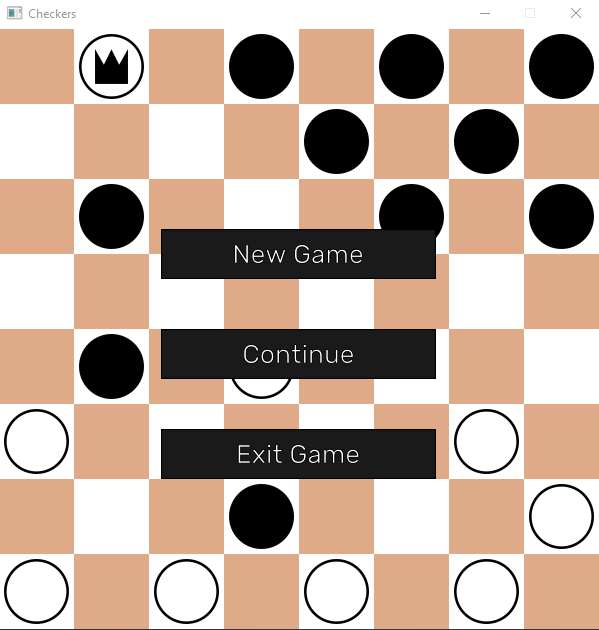

# Checkers
Project made by Szyszka M.  
A simple checkers created in C. Program is using SDL2 and SDL2_image libraries.

# Current Features
- Menu
- GameOver screen
- Player vs Player
- Movable checkers (kings are moving just one piece like regular checkers, it's not a bug)
- Modifiable Save file

# Missing
- Player vs AI
- Multiple captures

# Links
- SDL2: https://www.libsdl.org/
- SDL2_image: https://github.com/libsdl-org/SDL_image